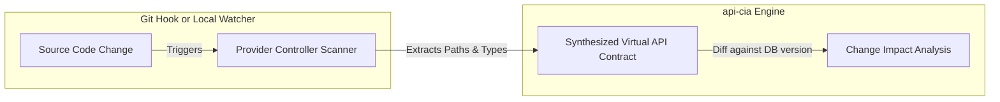

# Automatic Integration & Change Detection (No Manual YAML Files)

To integrate `api-cia` directly into any project so that it automatically detects API changes upon code modification without needing manual OpenAPI YAML/JSON contract files, you can implement one of two primary architectural strategies.

---

## Strategy A: The Provider AST Parser (Zero-Build, Pure Static Analysis)

Instead of requiring an OpenAPI YAML file, `api-cia` scans the **Provider Codebase** itself (e.g. the Spring Boot project containing the endpoints) using the same AST (Abstract Syntax Tree) logic as the Consumer Scanner.

### How to Build the Provider AST Parser
1. **Find Controllers**: Scan the provider codebase for classes annotated with `@RestController` or `@Controller`.
2. **Extract Base Paths**: Read the class-level `@RequestMapping` annotation value.
3. **Parse Endpoints (Methods)**: 
   - Scan for method-level routing annotations (`@GetMapping`, `@PostMapping`, `@PutMapping`, `@DeleteMapping`, `@RequestMapping`).
   - Extract the HTTP Method and Path segment (concatenate class-level mapping + method-level mapping).
4. **Parse Request/Response Models**:
   - Extract query parameters (`@RequestParam`), path parameters (`@PathVariable`), and request body classes (`@RequestBody`).
   - Recursively parse the fields and types of those request/response DTO classes to construct their schemas.
5. **Synthesize Virtual OpenAPI Object**: Convert this parsed AST structure directly into an OpenAPI structure in memory.

---

## Strategy B: Build-Time OpenAPI Extraction & CI/CD Push

Instead of parsing raw source code for the provider (which can be hard to generalize across different programming languages like Node.js, Go, Python, and Java), you hook into the **project's existing build system** to automatically generate and upload the OpenAPI spec on every change.

### How to Build the CI/CD Pipeline
1. **Automated Generation Plugin**:
   - For Java/Spring Boot: Add the `springdoc-openapi-maven-plugin` or `springdoc-openapi-gradle-plugin`.
   - Run: `./mvnw clean package` or `./mvnw spring-boot:run` in a background test mode to output `openapi.json` into the target directory.
2. **Git Hook or CI Action**:
   - Create a global shell script, a GitHub Action, or a Git Hook (`pre-commit` or `pre-push`).
   - When a commit is made:
     1. Build the project and auto-generate the updated `openapi.json`.
     2. Retrieve the previous commit's `openapi.json` (either from `api-cia`'s database or by checking out the previous git state and building it).
     3. Send both files via an API call to the `api-cia` backend.

---

## Comparing the Two Strategies

| Feature | Strategy A: AST Parser (Static) | Strategy B: CI/CD Build Hook (Dynamic/Build-Time) |
| :--- | :--- | :--- |
| **Aesthetics / Ease of Integration** | **Extremely Clean**: Developer just points `api-cia` to their project directory. | **Standardized**: Uses framework-native tools (`springdoc`, `swagger-express`, etc.). |
| **Language Support** | Requires a parser for *every* language you support (JavaParser for Java, Babel/TS-Parser for TS, etc.). | **Universal**: Any framework that can output OpenAPI / Swagger is supported. |
| **Accuracy** | Misses dynamic runtime configurations (e.g. filters, interceptors, dynamic servlet paths). | **100% Accurate**: Reflects the exact compiled runtime endpoint routing. |

---

## How to Trigger the Analysis on Change

To make the system know exactly what changed when a developer edits the code:

### 1. The Git Diff Approach
If `api-cia` has access to the Git repository of the provider:
- When a change occurs, run `git diff --name-only HEAD~1` (or compare branch vs `main`).
- Filter files to check if any file containing `@RestController` (or controllers) was modified.
- Parse *only* the modified files at `HEAD` and `HEAD~1` to isolate exactly which endpoints changed.

### 2. Local File Watcher Integration
- For local development, you can run a lightweight file-watcher (e.g., using Java's `WatchService` or a node/python tool) that monitors the source folders.
- Whenever a controller file changes, it runs the AST parser on that single file, compares the AST structure in-memory with the cached version, and reports immediate feedback in the IDE.
