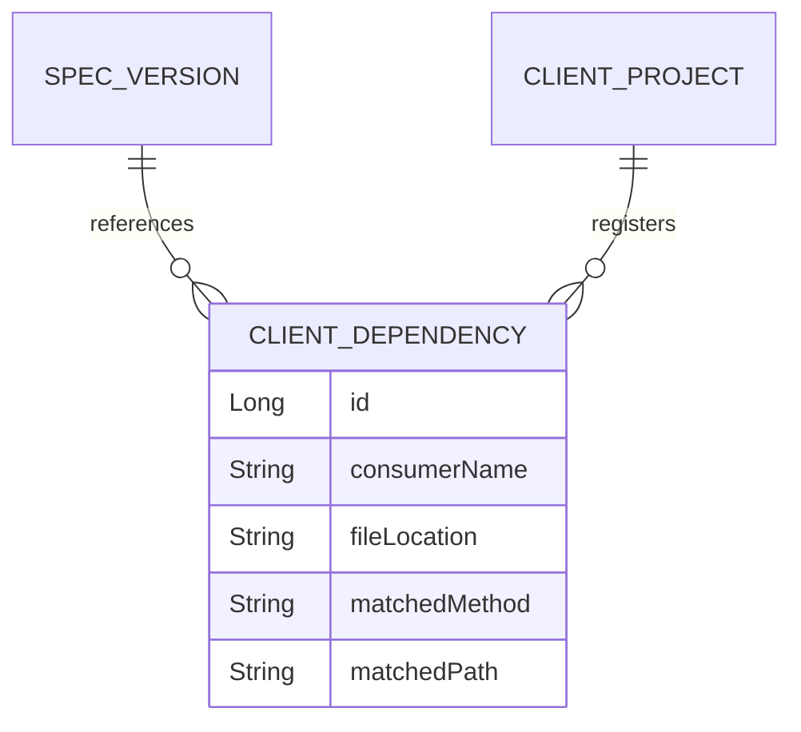

# Dependency Analyzer & Blast Radius: Architecture and Process Guide

This guide outlines the conceptual model, step-by-step pipeline, and system integration required to build a **Static-Analysis Dependency Analyzer** with **Blast Radius Detection** for the `api-cia` (API Change Impact Analyzer) platform.

---

## 1. Architectural Philosophy: The Static Pact Concept

Instead of setting up the complex runtime verification machinery of Pact (which requires mock servers, consumer tests, and contract broker synchronization), we borrow its **Consumer-Driven Contract model**. 

In Pact, a *Consumer* declares interactions (requests/responses) with a *Provider*. In our approach:
1. We treat client repositories as **Consumers**.
2. We treat our parsed OpenAPI specifications as the **Provider Contracts**.
3. We map dependencies by **statically scanning consumer codebase ASTs** (Abstract Syntax Trees) to find where they call provider endpoints, rather than verifying them dynamically during test execution.

```mermaid
graph TD
    subgraph Client Application (Consumer)
        Code[Feign / RestTemplate / WebClient Code]
    end

    subgraph Static Scanner (api-cia)
        JP[JavaParser AST Analyzer]
        Map[Consumer Dependency Map]
    end

    subgraph Provider Spec
        OAS[OpenAPI Specification]
    end

    Code -->|Scan AST| JP
    OAS -->|Extract Endpoints| JP
    JP -->|Generate| Map
    Map -->|Diff Violation| BlastRadius[Blast Radius Report]
```

---

## 2. Step 1: Parsing Client Codebases using JavaParser

To perform static analysis, you will add the **JavaParser** library to your `pom.xml`.

```xml
<dependency>
    <groupId>com.github.javaparser</groupId>
    <artifactId>javaparser-core</artifactId>
    <version>3.26.1</version>
</dependency>
```

### The AST Parsing Process
1. **Repository Discovery**: Traverse the client project's directory structure to locate all `.java` source files.
2. **Compilation Unit Creation**: For each file, invoke JavaParser to generate a `CompilationUnit` (the root node of the AST representation of the class).
3. **AST Visitor Pattern**: Use JavaParser's `VoidVisitorAdapter<Void>` to traverse specific syntactic nodes:
   - **Annotations**: Useful for Declarative clients like Feign.
   - **Method Calls**: Useful for Programmatic clients like `RestTemplate` or `WebClient`.

---

## 3. Step 2: Detecting HTTP Clients

Your static scanner needs to recognize three primary patterns of REST interactions in Spring Boot client codebases:

### Pattern A: Spring Cloud OpenFeign (Declarative)
Feign clients are the easiest to parse because they are strongly typed interfaces annotated with Spring MVC mapping annotations.

* **What JavaParser scans for**:
  - Class/Interface declarations annotated with `@FeignClient`.
  - Methods annotated with `@GetMapping`, `@PostMapping`, `@RequestMapping`, etc.
* **Extraction Rule**:
  - Base URL / Service Name: Read the `value` or `name` attributes of `@FeignClient`.
  - Path: Read the annotation value of `@GetMapping` (e.g. `@GetMapping("/api/v1/users/{id}")`) and combine it with any class-level `@RequestMapping`.

### Pattern B: Spring RestTemplate (Programmatic Classic)
`RestTemplate` calls usually look like `restTemplate.getForObject(url, Class)` or `restTemplate.exchange(url, ...)`.

* **What JavaParser scans for**:
  - `MethodCallExpr` where the method name is one of: `getForObject`, `getForEntity`, `postForObject`, `exchange`, `put`, `delete`, etc.
* **Extraction Rule**:
  - Retrieve the first argument of the method call. 
  - If the argument is a string literal (e.g., `"/api/v1/users"`), parse it directly.
  - If it is a constant, lookup the constant's value in the AST.
  - If it is dynamically built (e.g., `baseUrl + "/api/v1/users/" + userId`), evaluate the expression tree to extract the static path segments.

### Pattern C: Spring WebClient (Programmatic Reactive / Fluent)
`WebClient` uses a builder-style chain: `webClient.get().uri("/api/v1/users/{id}").retrieve()...`.

* **What JavaParser scans for**:
  - `MethodCallExpr` named `uri` chained after an HTTP method verb (`get`, `post`, `put`, `delete`).
* **Extraction Rule**:
  - Extract the argument passed to the `.uri(...)` call. If it is a template string (e.g., `"/api/v1/users/{id}"`), you have captured the exact client dependency.

---

## 4. Step 3: URL Path Matching and Normalization

A major challenge in static mapping is aligning a client URL with an OpenAPI path. For example, a client call to `/users/123` must match the OpenAPI path `/users/{id}`.

### The Normalization Pipeline

1. **Path Parameterization Detection**:
   - Replace standard variables in Feign/WebClient templates (e.g., `/users/{userId}` or `/users/{id}`) with a standardized format (e.g., `/users/{*}`).
   - Replace concatenated strings in Java code (e.g., `"/users/" + id` or `String.format("/users/%s", id)`) using regex replacement: `/users/[a-zA-Z0-9_-]+` becomes `/users/{*}`.
2. **Trie-Based Path Matching**:
   - Load all endpoints from the provider's OpenAPI spec.
   - Build a Routing Trie where each path segment is a node (e.g., `/api` -> `/v1` -> `/users` -> `{id}`).
   - For every parsed client URL, walk the Trie to find the best match. This resolves dynamic path variables reliably.

---

## 5. Step 4: Storage & Data Modeling

To scale the Blast Radius feature, you must persist the dependency relationships in your database.



### Table Structure Design
1. **`ClientProject`**: Metadata about registered consumer applications (e.g., name, repository URL, branch).
2. **`ClientDependency`**: Maps a specific file and line of code in the consumer to an endpoint.
   - `id`: Primary Key
   - `client_project_id`: Foreign key to `ClientProject`
   - `file_path`: (e.g., `src/main/java/com/client/service/UserService.java`)
   - `line_number`: Line of the call
   - `http_method`: (e.g., `GET`)
   - `normalized_path`: (e.g., `/api/v1/users/{id}`)

---

## 6. Step 5: Blast Radius Calculation & API Integration

When a new OpenAPI spec is uploaded and analyzed:

1. **Change Impact Evaluation**:
   - Your `SGMService` compares the new OpenAPI spec against the old one and generates `Violation` entities (e.g., `/api/v1/users/{id}` has a breaking change: parameter `email` is now required).
2. **Blast Radius Query**:
   - For each breaking change, query the `ClientDependency` table:
     ```sql
     SELECT cd.consumerName, cd.filePath, cd.lineNumber 
     FROM ClientDependency cd 
     WHERE cd.normalizedPath = :violatedPath AND cd.httpMethod = :violatedMethod
     ```
3. **Report Generation**:
   - Construct a `BlastRadiusDTO` showing:
     - The broken endpoint.
     - The severity (e.g., `CRITICAL`).
     - A list of impacted consumer projects and the exact file/line location.

### Response payload enrichment
You will modify the output of your `AnalysisResponseDTO` (from `AnalysisService.java`) to append client-side blast radius data:

```json
{
  "reportId": 12,
  "oldVersion": "v1.0.0",
  "newVersion": "v1.1.0",
  "impactScore": {
    "sTotal": 78.5,
    "riskLevel": "HIGH"
  },
  "blastRadius": {
    "totalImpactedConsumers": 2,
    "impactedEndpoints": [
      {
        "endpoint": "/api/v1/users/{id}",
        "method": "DELETE",
        "violations": ["DELETE operation removed entirely"],
        "consumers": [
          {
            "projectName": "web-frontend-bff",
            "file": "src/main/java/com/bff/client/UserClient.java",
            "line": 42
          },
          {
            "projectName": "reporting-service",
            "file": "src/main/java/com/reports/integration/UserClient.java",
            "line": 105
          }
        ]
      }
    ]
  }
}
```
